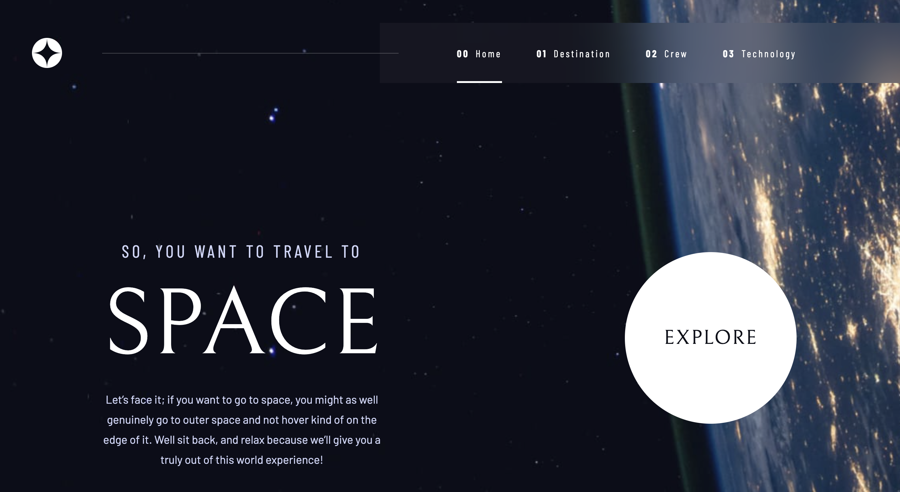

# Space tourism website

## Table of contents

- [Overview](#overview)
  - [The challenge](#the-challenge)
  - [Screenshot](#screenshot)
  - [Links](#links)
- [My process](#my-process)
  - [Built with](#built-with)
  - [What I learned](#what-i-learned)
- [Author](#author)

## Overview

### The challenge

Users should be able to:

- View the optimal layout for each of the website's pages depending on their device's screen size
- See hover states for all interactive elements on the page
- View each page and be able to toggle between the tabs to see new information
- On mobile, navbar should appear as a sidebar.

### Screenshot

### Links

- Live Site URL: (https://lively-pixie-fa8b8b.netlify.app/home)

## My process

As always, begin by setting up the project. Create a feature/setup branch. Install create-react-app, delete unnecessary files/dependencies, install ESLint, React Route, Styled Components, and Prettier config file. Create the src folder, where the app components will be stored. Create the main component folders and files in the src folder, and build out basic component architecture in each file. Add assets to an assets folder in the src folder.

Next, create the feature/basic-architecture branch. The key goal for this branch was to set up React Router. This was my first time using this technology, so I took my time learning the fundamentals. Finish this branch by mappning route paths to each related component.

The final feature branch was feature/pages. Create individual components for each route. This was necessary as each page was laid out uniquely from the next. Most pages, excluding the Home page, had data arrays allowing me to map through assets unique to that page. These assets included text and images. Once each page was styled, the project was essentially complete. All that remained were some general bug fixes.

Through out the course of this project, I kept a log of tasks, issues, and general thoughts in a Tasks.md file. This has been an invaluable addition to my project work flow and I will be sure to use this to my advantage in the future. Not only can I keep better track of what tasks I need to complete, but I can review these tasks after the fact. In a more general sense, I can refer to these tasks lists to hone my general approach to working through projects.

### Built with

- [React](https://reactjs.org/) - JS library
- [Next.js](https://nextjs.org/) - React framework
- [Styled Components](https://styled-components.com/) - For styles
- Flexbox
- Mobile-first workflow

### What I learned

My key personal progression on this project was having to think much carefully about what my project architecture would look like in the future. Previously, my projects consisted of a single component, or at least very basic grouped components. But this project tested my understaning of how to organize a project to a new level. I have noticed a specific change in how I think about projects when compared to how I previously approached far simpler projects.

React Router is the only completely new (to me) technology I used for this project. Certianly, this took some time to wrap my head around, especially due to the fact that Router 6 had come out somewhat recently, and almost all examples were shown in Router 5.

Besides this, the project was a major advancement in terms of difficulty. As a result, I had to take my tentative knowledge of other technologies, such as React and Styled Components, and take them to a new level.

## Author

- Personal Website - (https://nicholasblanco.com/)
